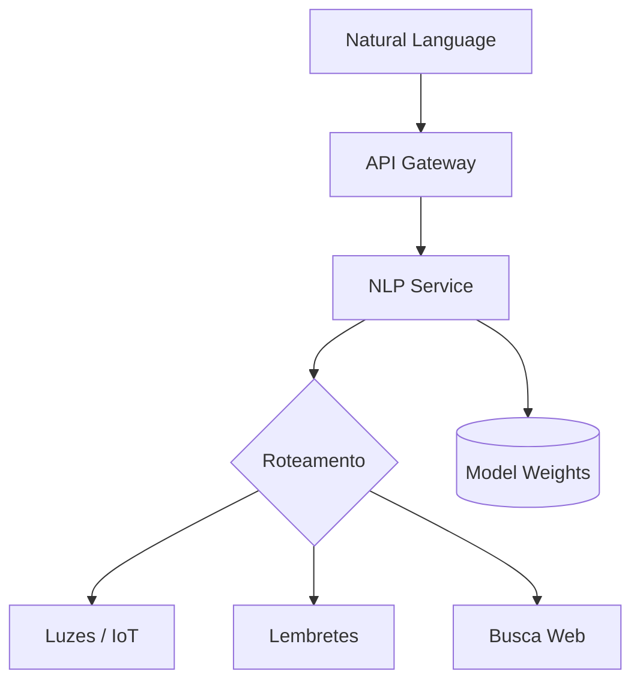

<div align=\"center\">

# 🧐 ALOY NLP Service

### **Inteligência Artificial Local e Privada com Google GEMMA**

[! [ALOY NLP](https://img.shields.io/badge/ALOY-NLP%20Service-6A5ACD?style=for-the-badge&logo=google-cloud&logoColor=white)](https://github.com/LuisMarchio03/aloy-nlp-service)
[! [Python](https://img.shields.io/badge/Python-3.10+-3776AB?style=flat-square&logo=python&logoColor=white)](https://www.python.org)
[! [FastAPI](https://img.shields.io/badge/FastAPI-Latest-009688?style=flat-square&logo=fastapi&logoColor=white)](https://fastapi.tiangolo.com)
[! [Model](https://img.shields.io/badge/Model-GEMMA--2B-7D4698?style=flat-square&logo=google-gemini&logoColor=white)](https://ai.google.dev/gemma)
[! [Status](https://img.shields.io/badge/Status-Active-brightgreen?style=flat-square)](https://github.com/LuisMarchio03/aloy-nlp-service)

**[Recursos](#-recursos)** • **[Arquitetura](#-arquitetura)** • **[Instalação](#-instalação)** • **[Uso](#-começando)** • **[API](#-api-endpoints)** • **[Contribuir](#-contribuindo)**

</div>

---

## 🌟 Visão Geral

O **ALOY NLP Service** é o cérebro cognitivo do assistente virtual ALOY. Utilizando o modelo de linguagem de ponta **Google GEMMA 2B**, este microserviço é capaz de processar linguagem natural, extrair intenções, identificar entidades e gerar respostas inteligentes — tudo isso rodando **localmente** para garantir máxima privacidade e segurança dos seus dados.

Desenvolvido com **Python** e **FastAPI**, o serviço é otimizado para execução em hardware doméstico (CPU/GPU), servindo como o motor principal de tomada de decisão do sistema.

### 💡 Por que ALOY NLP?

- 🛡️ **Privacidade Total**: Suas conversas nunca saem da sua rede local.
- 🧠 **Poderoso e Leve**: Baseado no GEMMA, o melhor modelo da sua categoria.
- 🎯 **Extração de Intenções**: Classificação precisa de comandos para outros microserviços.
- 🧩 **Context-Aware**: Mantém o histórico da conversa para respostas coerentes.
- 🚀 **Performante**: Implementação otimizada com quantization (4-bit/8-bit).

---

## ✨ Recursos

<table>
  <tr>
    <td width=\"50%\">
      ### 🤖 Inteligência Artificial
      - ✅ Processamento de Texto Local
      - ✅ Reconhecimento de Intenções (Intent Classification)
      - ✅ Extração de Entidades (NER)
      - ✅ Geração de Respostas Criativas
      - ✅ Sumarização de Textos
    </td>
    <td width=\"50%\">
      ### ⚙️ Engine & Otimização
      - ✅ Engine: Google GEMMA 2B
      - ✅ Suporte a CUDA (NVIDIA) e MPS (Apple)
      - ✅ Quantização via BitsAndBytes
      - ✅ Suporte a Llama.cpp / GGUF
      - ✅ Streaming de Respostas (Server-Sent Events)
    </td>
  </tr>
  <tr>
    <td width=\"50%\">
      ### 🔌 Integrações
      - ✅ REST API (FastAPI)
      - ✅ Conexão assíncrona com RabbitMQ
      - ✅ Integração com ALOY Desktop
      - ✅ Feedback Loop para melhoria contínua
      - ✅ Suporte a RAG (Retrieval-Augmented Generation)
    </td>
    <td width=\"50%\">
      ### 🛡️ Segurança & Ops
      - ✅ Execução 100% Offline
      - ✅ Rate Limiting customizável
      - ✅ Logs de auditoria estruturados
      - ✅ Métricas de uso de memória e GPU
      - ✅ Fácil configuração via ENV
    </td>
  </tr>
</table>

---

## 🏗️ Arquitetura

O NLP Service atua como o orquestrador de intenções, decidindo quais microserviços devem ser acionados.



---

## 🛠️ Instalação

### Pré-requisitos
- Python 3.10+
- NVIDIA GPU (Recomendado 8GB+ VRAM) ou CPU potente
- CUDA Toolkit instalado

### Passo a Passo

1. **Clone o repositório:**
   ```bash
   git clone https://github.com/LuisMarchio03/aloy-nlp-service.git
   cd aloy-nlp-service
   ```

2. **Crie o ambiente virtual:**
   ```bash
   python -m venv venv
   source venv/bin/activate  # Linux/Mac
   venv\\Scripts\\activate     # Windows
   ```

3. **Instale as dependências:**
   ```bash
   pip install -r requirements.txt
   ```

4. **Configure as variáveis de ambiente:**
   Crie um arquivo `.env` baseado no `.env.example`.

---

## 🚀 Começando

Para iniciar o serviço em modo de desenvolvimento:

```bash
uvicorn main:app --reload --port 8000
```

O serviço estará disponível em `http://localhost:8000`. Você pode acessar a documentação interativa em `/docs`.

---

## 🛣️ API Endpoints

| Método | Endpoint | Descrição |
| :--- | :--- | :--- |
| `POST` | `/v1/nlp/chat` | Envia uma mensagem e recebe a resposta da IA. |
| `POST` | `/v1/nlp/intent` | Analisa apenas a intenção da frase. |
| `GET` | `/v1/nlp/status` | Verifica a saúde do serviço e uso de hardware. |

---

## 🤝 Contribuindo

Contribuições são o que tornam a comunidade open source um lugar incrível para aprender, inspirar e criar. Qualquer contribuição que você fizer será **muito apreciada**.

1. Faça um Fork do projeto
2. Crie uma Branch para sua Feature (`git checkout -b feature/AmazingFeature`)
3. Insira suas mudanças (`git commit -m 'Add some AmazingFeature'`)
4. Faça o Push da Branch (`git push origin feature/AmazingFeature`)
5. Abra um Pull Request

---

<div align=\"center\">

Desenvolvido com ❤️ por [Luís Gabriel Marchió Batista](https://github.com/LuisMarchio03)

</div>
